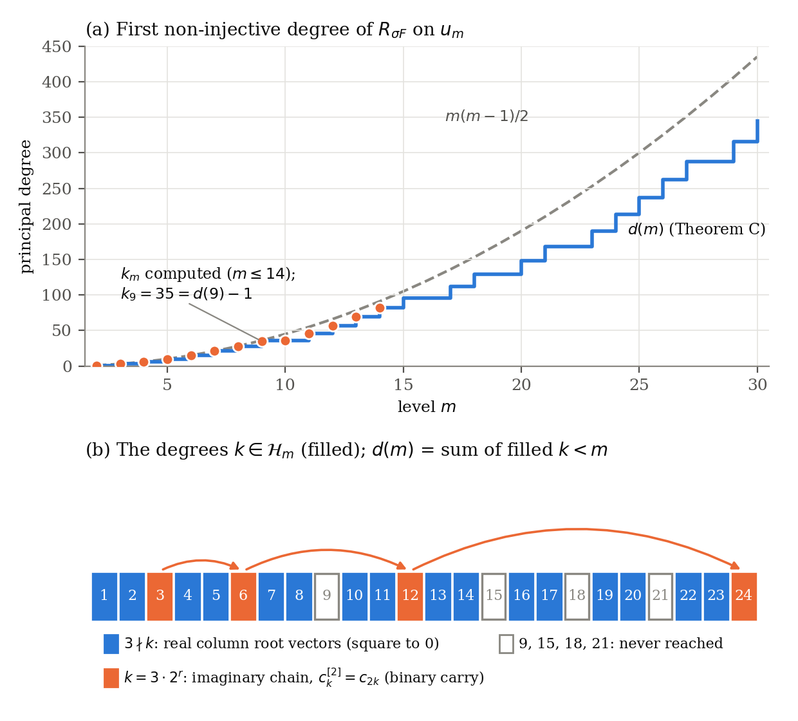
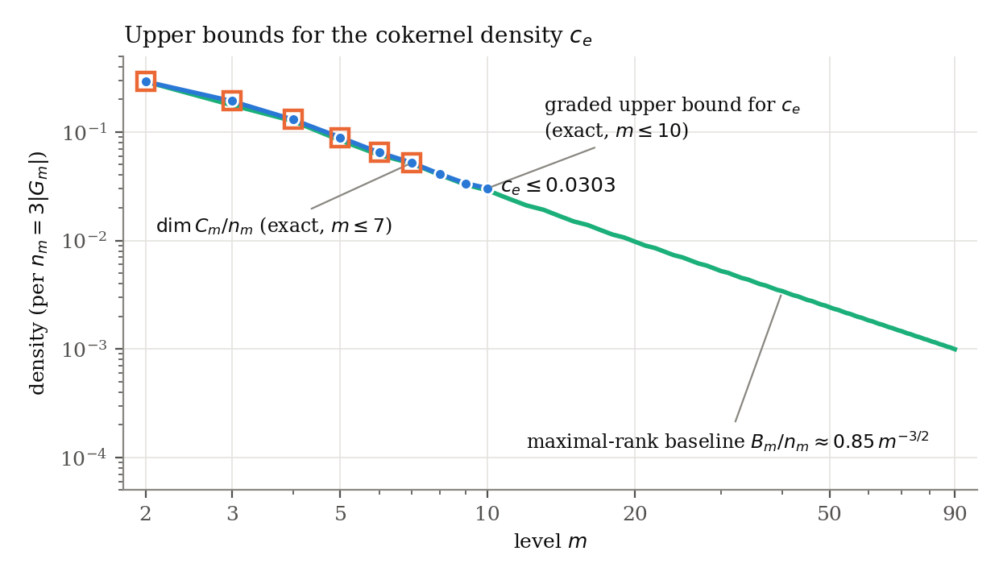

# anccft-ce-density

**The mod-2 cokernel density of a Hecke operator on a non-analytic pro-2 tower: split form, explicit kernels, and bounds**

Ruqing Chen, GUT Geoservice Inc., Montreal (ruqing@hotmail.com)

[](https://doi.org/10.5281/zenodo.23125494)

Paper, code, data and computation logs for the paper above. It continues *ANCCFT Volume III*, §6.8–6.9
(doi:10.5281/zenodo.23109523; code: [anccft-volume3](https://github.com/Ruqing1963/anccft-volume3)).

## The problem

Let `P = (1+φO)/(1+tF₂[[t]])`, `O = F₈[[φ;σ]]`, `φ³ = t`. This is the pro-2 group attached to the
Cartwright–Mantero–Steger–Zappa Ã₂-lattice of order 2, with tower `G_m = P/P_m`. Let
`F = 1 + f̄₁f̄₀f̄₂ ∈ F₂[G_m]` be the Hecke element of Vol. III. Define

    c_e = lim dim(F₂[G_m] / F₂[G_m]F) / (3|G_m|)

Two questions are open:

- Is `c_e = 0`? This would mean the 2-part of the Hecke Jacobian grows sub-linearly.
- Is `gr F₂[[P]]` a domain? This is Remark 6.9.2 of Vol. III.

By Jaikin-Zapirain, `c_e = (1 − rk_P(F))/3`. The pro-2 Atiyah conjecture would therefore give `c_e = 0`.

## Main results

| | Statement | Status |
|---|---|---|
| A | `u(gr P)` is **not** a domain: there is an explicit `v ∈ u₄` with `v² = 0`. No zero divisors of total degree ≤ 7. | proof by computation |
| B | `gr P ⊗ F₈` ≅ positive part of the affine Lie algebra **A₂⁽¹⁾** (principal grading). The leading form of `F` has weight δ (the null root). | proved |
| C | Explicit kernel `Σ u·ω_j` at every level. The threshold is `d(m) ≈ m²/3`, set by a binary odometer along the roots `3·2^r`. The kernel density is monotone in m. | proved |
| D | `dim C₇ = 10226`; graded cokernels 64216, 423412, 1526176 for m = 8, 9, 10. Hence **c_e ≤ 0.030322** (previously 0.0645). | proof by computation |
| E | `c_e = 0` follows from hypotheses (H1) and (H2) on the kernel of the leading form (Thm 9.4). (H1) is verified for m ≤ 10 and (H2) for m ≤ 14 (`k₁₂ = 57, k₁₃ = 69, k₁₄ = 82`; `k₁₅ ≤ 95` via the predicted exceptional element). | proved (conditional) |
| G | `F` is a non-zero-divisor in `F₂[[P]]`: its leading form is regular on `u(n̂)`, proved via evaluation representations of the loop algebra. Hence `k_m ≥ m − 3`. | proved |
| F | The graded zero divisors are obstructed at the first or second lifting step in `F₂[[P]]`. | proof by computation |
| H | No-go theorem: every level-by-level argument ("each kernel element dies in a quotient") bounds `k_m` by O(m^(3/2)), which is exactly what the conditional theorem cannot use. A proof of (H2) must be degree-sensitive, equivalently a vanishing theorem for Tor₁ over u(L_{≥m}) below degree c·m² (Rem. 7.2, `results/THEORY.md` §8). | proved |




## Repository layout

```
paper/      ce_paper.tex, ce_paper.pdf, figure PDFs   (pdflatex ce_paper.tex, twice)
code/       all Python scripts (see map below)
data/       CSV tables generated by code/make_data_and_figures.py
figures/    fig1_threshold_odometer.{pdf,png}, fig2_ce_bounds.{pdf,png}
results/    RESULTS.md (full computation log), THEORY.md (statements and proofs, labelled
            proved / verified / conjecture), raw_outputs/out_*.txt
```

## Data files

| File | Content |
|---|---|
| `data/levels.csv` | For each m: \|G_m\|, n_m, dim C_m, graded cokernel, the bound on c_e, k_m, d(m), m(m−1)/2 |
| `data/baseline.csv` | The maximal-rank baseline B_m/\|G_m\| for m ≤ 90 (≈ 2.55·m^(−3/2)) |
| `data/excess.csv` | Kernel density x_m and excess e_m; excess of σF versus a generic element of weight δ |
| `data/lifts.csv` | Kernel densities in F₂[G_m] of lifts of graded zero divisors, and controls |
| `data/thresholds.csv` | d(m), m(m−1)/2 and the set 𝓗_m for m ≤ 40 |

## Code map (paper item → scripts)

| Paper item | Scripts |
|---|---|
| Group G_m, element F | `common.py`, a port of `a2_common.TowerRing` from anccft-volume3 |
| GF(2) linear algebra | `gf2.py`, `gf2null.py` (bit-packed, numba) |
| dim C_m for m ≤ 7 (Thm D) | `task1_dimC.py`, `task4_crosscheck.py` |
| u(L), leading form σF (Prop 2.3) | `ulie.py`, `task2_leading.py`, `check_ulie_high.py` |
| Theorem A (zero divisors) | `task3b_exhaustive.py`, `verify_zd.py`, `verify_zd_3_14.py`, `analyze_zd.py`, `zdtools.py` |
| σF injectivity | `task3a_sigmaF.py`, `task3a2_sigmaF_far.py` |
| Theorem B (split form) | `taskC1_iso.py` |
| Graded bounds for m ≤ 10 (Thm D) | `cengine.py`, `taskC1_blocks.py`, `taskC_check_block.py`, `taskC1_spotcheck10.py` |
| Theorem C, thresholds k_m | `taskC3_lemmas.py`, `taskC2_low.py`, `taskC2_kernel.py`, `taskC2_eta_probe.py` |
| Jordan types, fits | `taskA1_jordan.py`, `taskA2_graded_jordan.py`, `taskA2_kernel.py`, `taskA4_fits.py` |
| Baseline and excess (§9) | `taskC4_model.py`, `taskC4_baseline.py`, `taskC4_fits.py`, `taskD*.py` |
| Lifting obstructions (Prop 10.1) | `b1_rank.py`, `b2_*.py`, `jalg.py`, `jtable.py` |
| Data and figures | `make_data_and_figures.py` |

Large intermediate files (pickles, Jennings multiplication tables of about 150 MB) are not included. The scripts
regenerate them.

## Requirements

Python ≥ 3.10, with numpy, numba, scipy and matplotlib (`pip install -r requirements.txt`).

Running times on an 8-core laptop:

- dim C₇: about 80 s.
- Graded bound at m = 10: about 7 min.
- Everything else: under 30 min per script.

## Citation

See `CITATION.cff`, or cite:

> R. Chen, *The mod-2 cokernel density of a Hecke operator on a non-analytic pro-2 tower: split form, explicit
> kernels, and bounds*, 2026. doi:10.5281/zenodo.23125494.

## License

- Code: MIT (see `LICENSE`).
- Paper, figures and data: CC BY 4.0.
